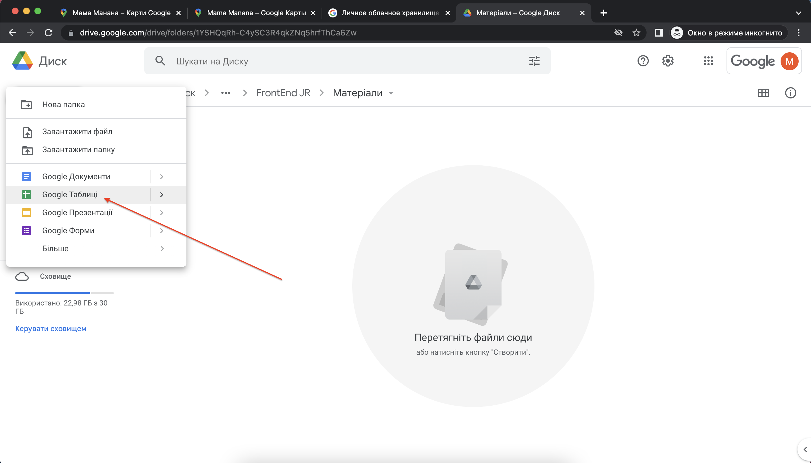

# Google-акаунт. Робота із мапою. Створення сайту. 
## Отримання даних з мапи
Зайдіть на <a href = "https://www.google.com/maps">Google.maps</a>. Погодьтеся із кукі.

Знайдіть точку, де ви знаходитесь (або точку в великому місту).

Оберіть заклад:  

У властивостях закладу ви побачите можливості мап по нааднню інформації про даний заклад

Натиснемо на кнопку "Поділитися"
  
Скопіюйте посилання на заклад
  

## Реєстрація акаунту Google
Якщо ви не зареєстровані в Google - створіть <a href = "https://github.com/mikh-maksi/it-independence/tree/main/lesson01">обліковий запис</a>.

## Робота із Google-документами
Відкрийте Google.документи та створіть таблицю
  
  
Змініть назву створеної таблиці
  
Скопіюйте та вставьте в таблицю інформацію про заклад
  
  
  
 

### Додаткове завдання
1. Знайдіть та додайте до таблиці від 5 до 10 закладів.
2. В таблиці відсотруйте заклади за типами.

Створіть сайт в Google.Документах 
  
Змініть заголовок сайту
  
  
Вставьте створену таблиую на сайт
  
  
  
  
  
Опублікуйте сайт
  
Подивіться на результат
  

## Швидкість набору
Швидкість набору тексту - це дуже важлива властивість майбутнього розробника сайтів. Давайте превіримо швидкість набору тексту:
<a href = "https://github.com/mikh-maksi/it-independence/tree/main/lesson06">Робота із клавіатурним тренажером</a>.
