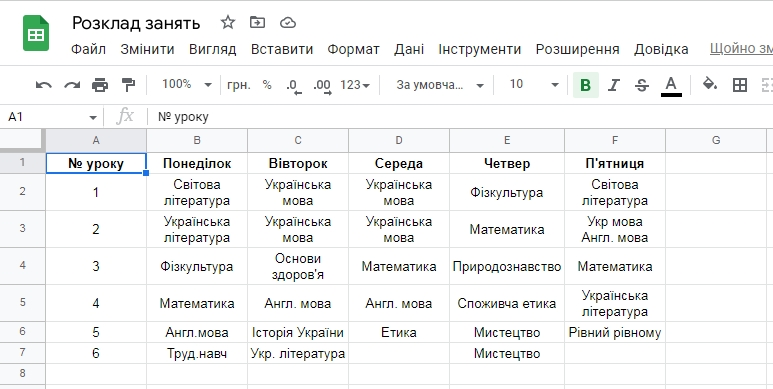

# Корисний сервіс.
Завдяки сайтам ми можемо зберігати зручну для нас інформацію. Наприклад, розклад уроків, таблицю множення, формули для навчання, тощо.
Можна все що завгодно розмістити на сайті, проте для цього необхідно таку інформацію підготувати.
1. Створимо розклад занять в <a href = "https://docs.google.com/spreadsheets/d/1nG52lXXVEzmOv2Yrs5svLbc5I_52VqjgbAQtsMaoYk8/edit#gid=0">Google-документі</a>.
  
2. Створимо відповідний сайт, та перенесемо до нього таблицю.
3. Згенеруємо таблицю за допомогою HTML-генератору https://www.tablesgenerator.com/html_tables
4. Заповнемо календар (створимо подію для всіх - заняття з FrontEnd).
5. Створимо сайт з розкладом уроків https://www.canva.com/uk_ua/stvoryty/rozklad-urokiv/
6. 