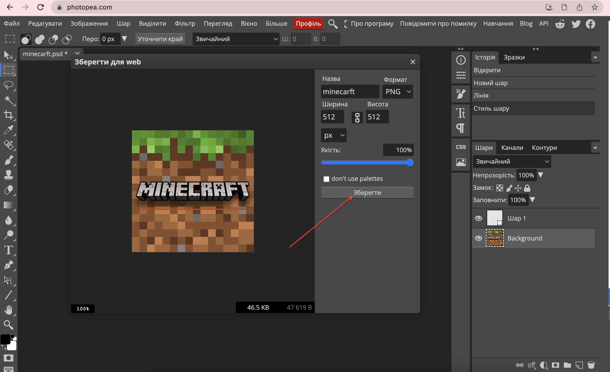

# Динамічні картинки
1. Скачуваємо картинку для майбтньої анімації
  

2. Відкриваємо картинку із допомогою графічного редактору <a href = "https://www.photopea.com/">https://www.photopea.com/</a>
  

  

3. Експортуємо незмінений шар завантаженого зображення
  

  

4. Створюємо новий шар (на якому ми будемо додавати нові елементи анімації)  
  

5. Додаємо елементи анімації (в даному випадку - лінію)
  
  
  
  

6. Експортуємо створений шар
  
  

7. Відкриваємо сервіс для створення gif-анімованого зображення  <a href = "https://ezgif.com/maker">https://ezgif.com/maker</a>
  

8. Створюємо зображення із підготовлених кадрів
  
  
  
  
  
 

9. Завантажимо стврене зображення на сервіс Repl.it (в якому вже створили сайт)
  
  

10. Додамо зображення до сайту
  
  
  
  
