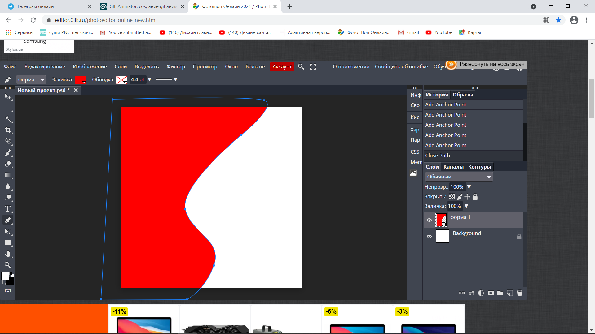

**Крок 1**
Відкриваємо графічний редактор за посиланням [https://www.photopea.com/](https://www.photopea.com/)  

**Крок 2**
Натискаємо кнопку створити

**Крок 3**
У висоті та ширині вказуємо цифру 297 мм та розширення 300 пп
   

Натискаємо кнопку створити
  
**Крок 4** 
Беремо інструмент ручка ( Р )  
  
  
**Крок 5**  
Ставимо крапку за межами монтажної області, ставимо другу точку вище і затискаємо її направляємо спливлі лінії з боків.

**Крок 6**  
Ставимо наступну точку та повторюємо дію 6 

**Крок 7**  
Замикаємо фігуру-клікнувши по точці з якої починали  

**Крок 8**
Ставимо заливку. Нагорі знаходиться кольоровий прямокутник, натискаємо на нього і вибираємо єдиний із запропонованих квадратів - Прямокутник і вибираємо колір - натискаємо на кнопку ок.
  

**Крок 9**
Повторюємо Кроки 6,7,8,9 ( ТІЛЬКИ , фігуру малюємо трохи далі від попередньої (зі зміщенням вправо ) і змінюємо колір на інший (схожий за тональністю)

**Крок 10**  

Переходимо в папку шари праворуч і затискаємо верхній шар з новою фігурою, переносимо її під попередню, відпускаємо клавішу.

**Крок 11**  
Беремо знову інструмент ручка (Р) та малюємо коло, в якому будуть великі цифри
   
  
**Крок 12**  
Далі пишемо текст (Заголовок). Вибираємо інструмент текст (Т), ставимо крапку де хочемо почати писати, зверху, ліворуч змінюємо його вигляд, розмір і колір, пишемо текст, натискаємо галочку зверху праворуч. 

  

**Крок 13**  
Продовжуємо наповнення тексту так само
  
  
**Крок 14**  
Переходимо в папку *файл* , натискаємо *відкрити та помістити*, поміщаємо картинку
  
**Крок 15**  
Переходимо в *файл* і натискаємо експортувати - в пнг
зберігаємо в папку на робочому столі під назвою *пончик*
  

**Крок 16**
Натискаємо Ctl+J для копіювання картинки
  
  
**Крок 17**
Натискаємо на око в попередньому шарі пончика
  
**Крок 18**
Натискаємо правою кнопкою по копії шару пончика і натискаємо *Растрування*

  
**Крок 19**
Вибираємо інструмент ласо і виділімо частину пончика (начебто його відкусили) і натискаємо кнопку backspace, потім натискаємо Ctrl+D, для зняття виділень

**Крок 20**
Повторюємо Кроки з 15 по 20 (копіюємо - прибираємо нижнього шару видимість - обрізаємо частину - зберігаємо в пнг)
повторюємо два рази (повинно бути 4 картинки пончика в шарах)

**Крок 21**
Переходимо за посиланням [https://ezgif.com/maker](https://ezgif.com/maker)
і натискаємо кнопку *вибрати файли*, вибираємо всі картинки, збережені на робочому столі в папці *пончик*

**Крок 22**
Натисніть кнопку **"Upload and make a GIF!"**

**Крок 23**
Змінимо значення **Delay Time** на 100 (значення в міліскундах відповідає інтервалу показу слайдів в 1 секунду).

**Крок 24**
Збережемо створену gif-анімацію

**Крок 25**
Натискаємо на кнопку *download* та зберігаємо вашу роботу на Комп'ютер
ВАША ГІФ АНІМАЦІЯ ГОТОВА !))

