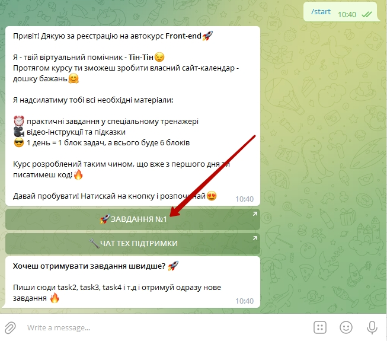

# Дошка бажань
Проведення заняття із використанням системи автоперевірки.
В результаті проведеного заняття - у студентів буде сформована дошка бажань: три мети, які цікаві для підлітка.
Для початку роботи в цьому напрямку необхідно переслати студентам наступне посилання:
<a href = "https://t.me/goiteens_edu_bot?start=TG-TEENS_FREE_FE">https://t.me/goiteens_edu_bot?start=TG-TEENS_FREE_FE</a> в результаті чого - студенти перейдуть до телеграм-бота, який надсилає завдання.

Іноді можуть виникнути технічні питання і в такому разі можна надати посилання для прямого доступу до завдань: 
<a href = "https://html-css-js-autocheck.goiteens.com/?token=d5fcc3783ba50fcac78b5a5ea8e4d69f6fe51ed8368bc618a58a846ad8b03a63&block=wxyz01a70" target = "_blank">Task 1</a> 
<a href = "https://html-css-js-autocheck.goiteens.com/?token=d5fcc3783ba50fcac78b5a5ea8e4d69f6fe51ed8368bc618a58a846ad8b03a63&block=xyz01ab71" target = "_blank">Task 2</a> 
<a href = "https://html-css-js-autocheck.goiteens.com/?token=d5fcc3783ba50fcac78b5a5ea8e4d69f6fe51ed8368bc618a58a846ad8b03a63&block=yz01abc72" target = "_blank">Task 3</a> 
<a href = "https://html-css-js-autocheck.goiteens.com/?token=d5fcc3783ba50fcac78b5a5ea8e4d69f6fe51ed8368bc618a58a846ad8b03a63&block=z01abcd73" target = "_blank">Task 4</a> 
<a href = "https://html-css-js-autocheck.goiteens.com/?token=d5fcc3783ba50fcac78b5a5ea8e4d69f6fe51ed8368bc618a58a846ad8b03a63&block=01abcde74" target = "_blank">Task 5</a> 
<a href = "https://html-css-js-autocheck.goiteens.com/?token=d5fcc3783ba50fcac78b5a5ea8e4d69f6fe51ed8368bc618a58a846ad8b03a63&block=1abcdef75" target = "_blank">Task 6</a>
  
Після підключення до боту - він видає наступні повідомлення:  
  
  
  
  
  

  
  
  
<h2>Завдання 2</h2>
  

  
  
  
  
  