# FlexBox.
В цьому занятті ми з вами познайомимося із технологією FlexBox.
Це технологія, за допомогою якої можна позиціонувати елементи на сторінці.
Наприклад, у нас є три блока: жовтий, зелений та ще один жовтий.  
Ми їх зробили розміром по ширині та висоті 100 пікселів, та додали границю шириною 1 піксель.  
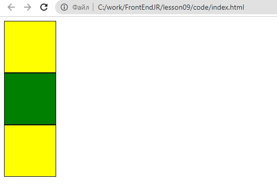  
Для реалізації такої картинки ми зробили наступний код в index.html:  
```html
<!DOCTYPE html>
<html lang="en">
<head>
    <meta charset="UTF-8">
    <meta http-equiv="X-UA-Compatible" content="IE=edge">
    <meta name="viewport" content="width=device-width, initial-scale=1.0">
    <title>Document</title>
    <link rel="stylesheet" href="css/style.css">
</head>
<body>
    <div class="d1"></div>
    <div class="d2"></div>
    <div class="d3"></div>
</body>
</html>
```  
Та в style.css:  

```css
.d1{
    width:100px;
    height:100px;
    border:1px solid;
    background: yellow;
}
.d2{
    width:100px;
    height:100px;
    border:1px solid;
    background: green;
}
.d3{
    width:100px;
    height:100px;
    border:1px solid;
    background: yellow;
}
```
### Завдання:
1. Скопіюйте відповідний код, так щоб у вас получилась аналогічна картинка.
2. Додайте 4-й блок синього кольору.
3. Зробіть розмір блоків 200x200
4. Зробіть границю блока №2 з неперервної (solid) на пунктирну (dashed).


## Розміщення на сторінці:
Але, за умовами завдання, наприклад, вам необхідно, щоб створені квадартики були розміщені один поруч з одним.  
Для цього нам необхідно змінити позіонування того простору, в якому вони находяться.  
Огорнемо всі створені блоки блоком із класом wrapper  
**index.html**  
```html
<!DOCTYPE html>
<html lang="en">
<head>
    <meta charset="UTF-8">
    <meta http-equiv="X-UA-Compatible" content="IE=edge">
    <meta name="viewport" content="width=device-width, initial-scale=1.0">
    <title>Document</title>
    <link rel="stylesheet" href="css/style.css">
</head>
<body>
    <div class="wrapper">
        <div class="d1"></div>
        <div class="d2"></div>
        <div class="d3"></div>
    </div>
</body>
</html>
```  
**style.css**  
```css
.wrapper{
    display: flex;
}

.d1{
    width:100px;
    height:100px;
    border:1px solid;
    background: yellow;
}
.d2{
    width:100px;
    height:100px;
    border:1px solid;
    background: green;
}
.d3{
    width:100px;
    height:100px;
    border:1px solid;
    background: yellow;
}
```

В результаті отримаємо наступний вигляд:  
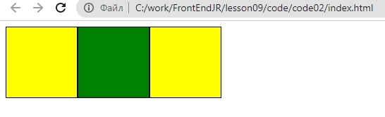

### Завдання
Напишіть код, що відображає наступний вигляд блоків:
1. 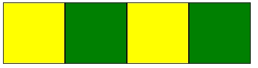
2. 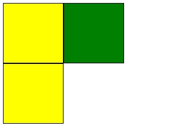
3. 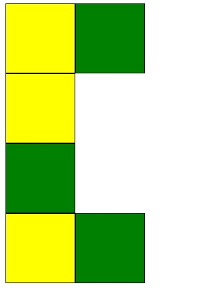
4. 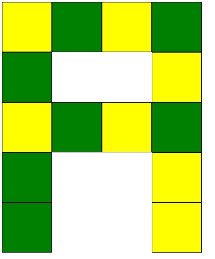
5. Створіть з блоків букву, що йде першою у вашому імені.


## Вирівнювання
Існують задачі, при яких нам необхідно щоб блоки були вирівняни не по лівом краю (як за замовчуванням), а за іншим принципом. Наприклад, по правому краю. Для цього до нашого блоку-обгортки ми додамо параметр **justify-content:** зі значенням **flex-end;**


**index.html**
```html
<!DOCTYPE html>
<html lang="en">
<head>
    <meta charset="UTF-8">
    <meta http-equiv="X-UA-Compatible" content="IE=edge">
    <meta name="viewport" content="width=device-width, initial-scale=1.0">
    <title>Document</title>
    <link rel="stylesheet" href="css/style.css">
</head>
<body>
    <div class="wrapper">
        <div class="d1"></div>
        <div class="d2"></div>
        <div class="d1"></div>
    </div>
</body>
</html>
```  

**style.css**

```css
.wrapper{
    display: flex;
    justify-content: flex-end;
}

.d1{
    width:100px;
    height:100px;
    border:1px solid;
    background: yellow;
}
.d2{
    width:100px;
    height:100px;
    border:1px solid;
    background: green;
}
.d3{
    width:100px;
    height:100px;
    border:1px solid;
    background: yellow;
}
```
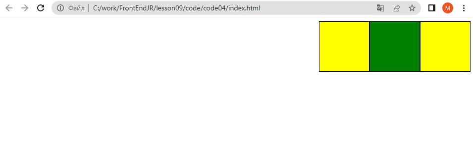

### Питання
1. Що змінилося в коді блоків відносно попереднього завдання.
2. Як можна спростити код CSS?

Також, маємо наступні можливості вирівнювання блоків на екрані:  
**justify-content: center;**  
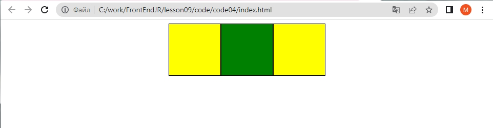  
Вирівнювання по центру

**justify-content: space-around;**  
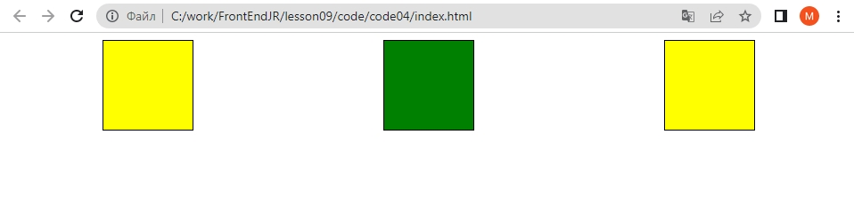  
Вільний простір розподіляється равномірно навкруги кожного елемента
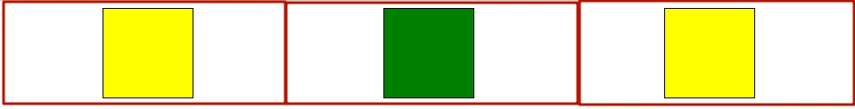
  
**justify-content: space-between;**  
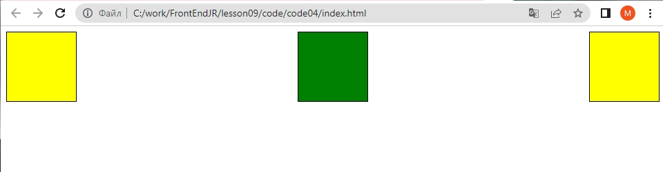  
Крайні елементи становляться в крайні точки, а простір між елементами в середині розподіляється рівномірно
  
**justify-content: space-evenly;**  
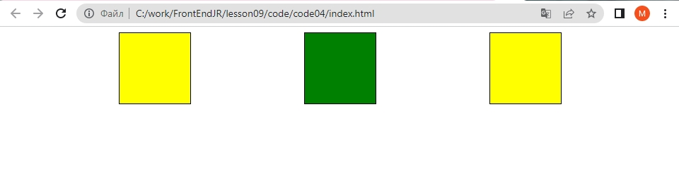  
Всі відступи (між елементами та між крайніми елементами та кінцем екрану - однакові). 
  
## Інтерактивний тренажер
Закріпимо знання із flex-box за допомогою інтерактивного тренажеру <a href = "https://flexboxfroggy.com/#uk" target = _blank>FlexFroggy</a>  
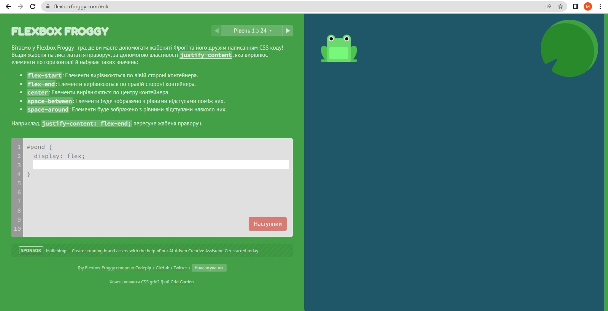  
Ми будемо вписувати код в лівій частині, та отримувати результат (пересування жабок на листочки) в правій:  
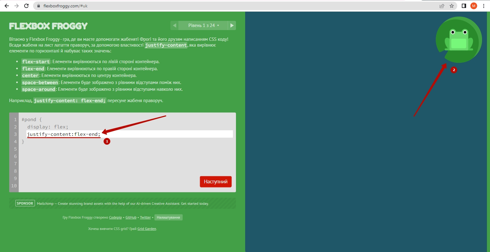  

### Завдання 
1. Пройти тренажер <a href = "https://flexboxfroggy.com/#uk" target = _blank>FlexFroggy</a>

### Творче завдання 
1. Реалізувати у власному коді положення блоків аналогічне тим, що приведені в завданнях FlexFroggy.


### Додаткові завдання:
1. Пройти тренажер <a href = "http://www.flexboxdefense.com/" target = _blank>flexboxdefense</a>  
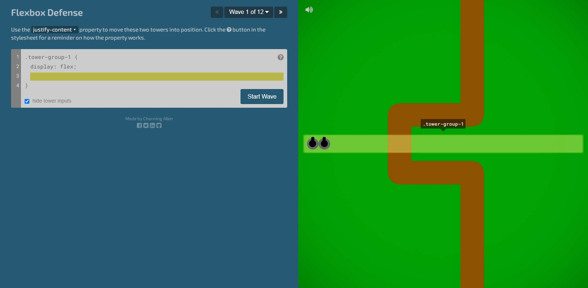


