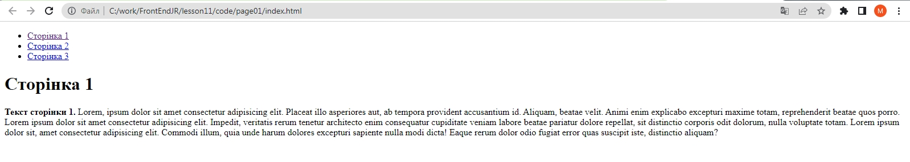
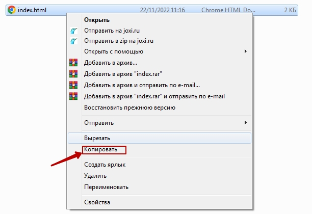
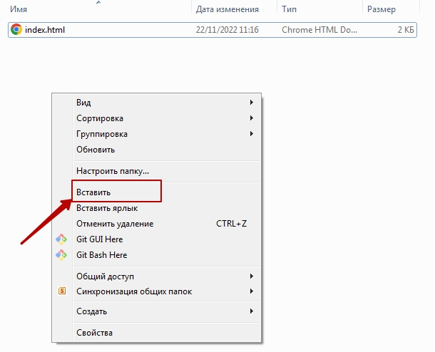
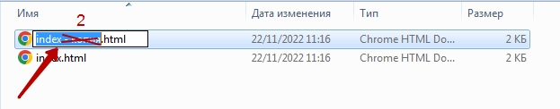
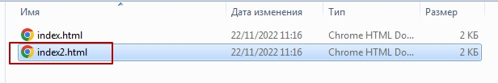
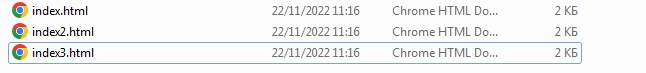
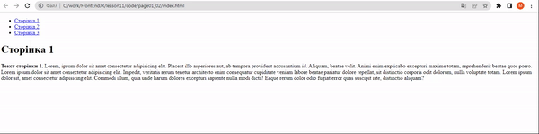
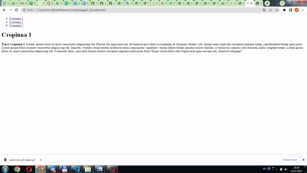
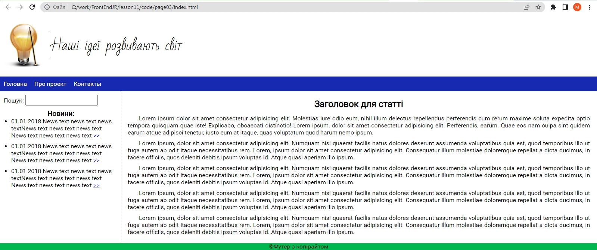

# Сайт із використанням FlexBox
## Структура сайтів
Типовими елементами, з яких складаються сайти є шапка, меню, колонки, підвал.
Для створення цих елементів необхідно вже володіти всіма елементами, які необхідні для створення сайту.  

## Посилання
Найпростіший приклад із використанням посиланням - це посилання на зовнішній сайт:


Створимо заготовку 



```html
<!DOCTYPE html>
<html lang="en">
<head>
    <meta charset="UTF-8">
    <meta http-equiv="X-UA-Compatible" content="IE=edge">
    <meta name="viewport" content="width=device-width, initial-scale=1.0">
    <title>Document</title>
</head>
<body>
    <ul>
        <li><a href="index.html">Сторінка 1</a></li>
        <li><a href="index2.html">Сторінка 2</a></li>
        <li><a href="index3.html">Сторінка 3</a></li>
    </ul>
    <h1>Сторінка 1</h1>
    <p><b>Текст сторінки 1.</b> Lorem, ipsum dolor sit amet consectetur adipisicing elit. Placeat illo asperiores aut, ab tempora provident accusantium id. Aliquam, beatae velit. Animi enim explicabo excepturi maxime totam, reprehenderit beatae quos porro. Lorem ipsum dolor sit amet consectetur adipisicing elit. Impedit, veritatis rerum tenetur architecto enim consequatur cupiditate veniam labore beatae pariatur dolore repellat, sit distinctio corporis odit dolorum, nulla voluptate totam. Lorem ipsum dolor sit, amet consectetur adipisicing elit. Commodi illum, quia unde harum dolores excepturi sapiente nulla modi dicta! Eaque rerum dolor odio fugiat error quas suscipit iste, distinctio aliquam? </p>
</body>
</html>

```
Зробимо копію сторінки `index.html` в тій самій папці.
  
  

Змінемо назву файлу на `index2.html`  
  
  

Зробимо ще одну копію сторінки `index.html` та змінемо назву файлу на `index3.html`  

  

Тепер ми можемо переходити зі сторінки на сторінку.  
  

Проте, в нас на кожній сторінці написаний однаковий текст. І ми можемо змінити текст на сторінках.

```html
<!DOCTYPE html>
<html lang="en">
<head>
    <meta charset="UTF-8">
    <meta http-equiv="X-UA-Compatible" content="IE=edge">
    <meta name="viewport" content="width=device-width, initial-scale=1.0">
    <title>Document</title>
</head>
<body>
    <ul>
        <li><a href="index.html">Сторінка 1</a></li>
        <li><a href="index2.html">Сторінка 2</a></li>
        <li><a href="index3.html">Сторінка 3</a></li>
    </ul>
    <h1>Сторінка 2</h1>
    <p><b>Текст сторінки 2.</b> Lorem, ipsum dolor sit amet consectetur adipisicing elit. Placeat illo asperiores aut, ab tempora provident accusantium id. Aliquam, beatae velit. Animi enim explicabo excepturi maxime totam, reprehenderit beatae quos porro. Lorem ipsum dolor sit amet consectetur adipisicing elit. Impedit, veritatis rerum tenetur architecto enim consequatur cupiditate veniam labore beatae pariatur dolore repellat, sit distinctio corporis odit dolorum, nulla voluptate totam. Lorem ipsum dolor sit, amet consectetur adipisicing elit. Commodi illum, quia unde harum dolores excepturi sapiente nulla modi dicta! Eaque rerum dolor odio fugiat error quas suscipit iste, distinctio aliquam? </p>
</body>
</html>

```


```html
<!DOCTYPE html>
<html lang="en">
<head>
    <meta charset="UTF-8">
    <meta http-equiv="X-UA-Compatible" content="IE=edge">
    <meta name="viewport" content="width=device-width, initial-scale=1.0">
    <title>Document</title>
</head>
<body>
    <ul>
        <li><a href="index.html">Сторінка 1</a></li>
        <li><a href="index2.html">Сторінка 2</a></li>
        <li><a href="index3.html">Сторінка 3</a></li>
    </ul>
    <h1>Сторінка 3</h1>
    <p><b>Текст сторінки 3.</b> Lorem, ipsum dolor sit amet consectetur adipisicing elit. Placeat illo asperiores aut, ab tempora provident accusantium id. Aliquam, beatae velit. Animi enim explicabo excepturi maxime totam, reprehenderit beatae quos porro. Lorem ipsum dolor sit amet consectetur adipisicing elit. Impedit, veritatis rerum tenetur architecto enim consequatur cupiditate veniam labore beatae pariatur dolore repellat, sit distinctio corporis odit dolorum, nulla voluptate totam. Lorem ipsum dolor sit, amet consectetur adipisicing elit. Commodi illum, quia unde harum dolores excepturi sapiente nulla modi dicta! Eaque rerum dolor odio fugiat error quas suscipit iste, distinctio aliquam? </p>
</body>
</html>
```

  


#### Завдання
1. Наповніть сторінки із назвами (наприклад: Головна/Мої вподобання/Мій розклад) та наповніть її контентом.
2. Створіть новий репозитарій, та розмістіть там створені зв'язані сторінки.

## Створення та наповнення сайту.
Візьмемо заготовку сайту.
  

**index.html**
```html
<!DOCTYPE html>
<html lang="ru">
<head>
  <meta charset="UTF-8">
  <title>Document</title>
  <link href = "css/style_flex.css" rel = "stylesheet">
  <link href="https://fonts.googleapis.com/css?family=Bad+Script" rel="stylesheet">
</head>
<body>
  <div class = "wrapper">
    <header>
      <div class="logo"></div>
      <div class="slogan">Наші ідеї розвивають світ</div>
    </header>

    <nav>
     <ul class="menu">
      <li><a href=#>Головна</a></li>
      <li><a href=#>Про проект</a></li>
      <li><a href=#>Контакты</a></li>
  </ul>
    </nav>
    <main>
      <aside>
        <div class="sWrapper">
            <p class = "search">Пошук: <input type="text"></p>
            <h3> Новини:</h3>
        <ul class = "news">
            <li><span class = "date">01.01.2018</span> News text news text news textNews text news text news text
              News text news text news text <a href="http://">>></a> </li>
            <li><span class = "date">01.01.2018</span> News text news text news textNews text news text news text
                News text news text news text <a href="http://">>></a> </li>
            <li><span class = "date">01.01.2018</span> News text news text news textNews text news text news text
                  News text news text news text <a href="http://">>></a> </li>
        </ul>

        </div>
        </aside>
      
      <article>
        <div class="aWrapper">
        <h1>Заголовок для статті</h1>
		<p>Lorem ipsum dolor sit amet consectetur adipisicing elit. Molestias iure odio eum, nihil illum delectus repellendus perferendis cum rerum maxime soluta expedita optio tempora quisquam quae iste! Explicabo, obcaecati distinctio!
      Lorem ipsum, dolor sit amet consectetur adipisicing elit. Perferendis, earum. Quae eos nam culpa sint quidem earum atque adipisci tenetur, iusto eum at itaque, quas voluptatum quod harum nemo ipsum.
    </p>
			
		<p>Lorem ipsum, dolor sit amet consectetur adipisicing elit. Numquam nisi quaerat facilis natus dolores deserunt assumenda voluptatibus quia est, quod temporibus illo ut fuga autem ab odit itaque necessitatibus rem.
        Lorem, ipsum dolor sit amet consectetur adipisicing elit. Consequatur illum molestiae doloremque repellat a dicta ducimus, in facere officiis, quos deleniti debitis ipsum voluptas id. Atque quasi aperiam illo ipsum.
    </p>
    <p>Lorem ipsum, dolor sit amet consectetur adipisicing elit. Numquam nisi quaerat facilis natus dolores deserunt assumenda voluptatibus quia est, quod temporibus illo ut fuga autem ab odit itaque necessitatibus rem.
          Lorem, ipsum dolor sit amet consectetur adipisicing elit. Consequatur illum molestiae doloremque repellat a dicta ducimus, in facere officiis, quos deleniti debitis ipsum voluptas id. Atque quasi aperiam illo ipsum.
    </p>
    <p>Lorem ipsum, dolor sit amet consectetur adipisicing elit. Numquam nisi quaerat facilis natus dolores deserunt assumenda voluptatibus quia est, quod temporibus illo ut fuga autem ab odit itaque necessitatibus rem.
       Lorem, ipsum dolor sit amet consectetur adipisicing elit. Consequatur illum molestiae doloremque repellat a dicta ducimus, in facere officiis, quos deleniti debitis ipsum voluptas id. Atque quasi aperiam illo ipsum.
    </p>
    <p>Lorem ipsum, dolor sit amet consectetur adipisicing elit. Numquam nisi quaerat facilis natus dolores deserunt assumenda voluptatibus quia est, quod temporibus illo ut fuga autem ab odit itaque necessitatibus rem.
        Lorem, ipsum dolor sit amet consectetur adipisicing elit. Consequatur illum molestiae doloremque repellat a dicta ducimus, in facere officiis, quos deleniti debitis ipsum voluptas id. Atque quasi aperiam illo ipsum.
    </p>
    </div>
    </article>
    
    </main>
	<div class = "clear"></div>
    <footer>
      <p>Футер з копірайтом</p>
    </footer>
  </div>
</body>
</html>

```

**style_flex.css**
```css
* {
    margin: 0;
    padding: 0
}

body {
    font-family: Roboto;
}

header {
    height: 168px;
    display: flex;
}

nav {
    background: #1729B0;
}

main {
    display: flex;
    padding: 0;
}

article {
    min-height: 300px;
    margin-left: -5px;
    border-left: 1px dotted black;
}


footer {
    background: #00B64F;
    
    text-align: center;
}

nav ul {
    display: flex;
    margin: 0;
    padding: 0;
    list-style: none;
}


nav ul.menu>li>a {
    display: block;
    padding: 10px;
    color: white;
    background-color: #1729B0;
    text-decoration: none;
}

nav ul.menu>li>a:hover {
    background-color: #00B64F;
}

.logo {
    margin: 20px 0;
    height: 128px;
}

.slogan {
    align-self:center;
    border-left: 1px solid;
    vertical-align: middle;
    padding-left: 10px;
    font-family: 'Bad Script', cursive;
    font-size: 36px;
}

p.titleNews {
    text-align: center;
}

ul.news {
    margin-left: 20px;
}

ul.news li {
    margin-bottom: 10px;
}

footer p::before {
    content: '\00A9';
}

div.sep {
    width: 1%;
    margin-left: -5px;
    border-right: 1px solid black;
}

.aWrapper {
    margin: 20px;
}

.aWrapper h1 {
    text-align: center;
    margin-bottom: 15px;
}

.aWrapper p {
    text-indent: 30px;
    text-align: justify;
    margin-bottom: 10px;
}

.sWrapper {
    margin: 10px;
}

.sWrapper h3 {
    text-align: center;
}

.search {
    margin-bottom: 10px;
}

.search input {
    width: 190px;
    height: 25px;
    font-family: Roboto;
    font-size: 18px;
}

ul.events {
    margin-left: 20px;
}

```

#### Наповнення сайту
1. Наповність створений сайт контентом з попереднього завдання.
2. Створіть новий репозитарій та розмістіть створений сайт там.