# Інтерактивний каталог
В попередньому уроці ми з вами створювали каталог улюблених ігор. Але, за допомогою сайтів, можна створити каталог будь-чого. Наприклад, каталог інтерактивних тренажерів та підручників з шкільних навчальних предметів.  
Наприклад:  

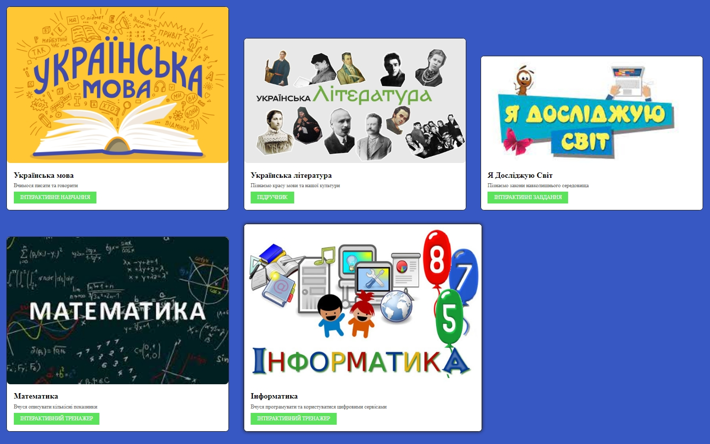

<a href = "https://mikh-maksi.github.io/FrontEndJR/lesson12/code/code02/index.html">Приклад каталогу</a>

На нашому заняттю, ми з вами зробимо власний каталог із власним набором інтерактивного навчання.

## Зміни
Далі - познайомимося із елементами каталогу.
### Фон
Змінимо фон:
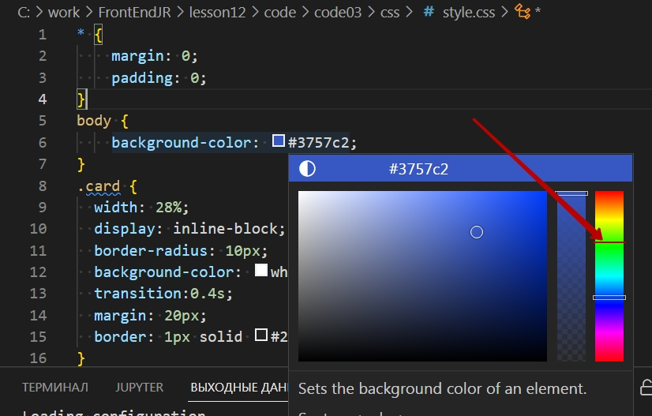  
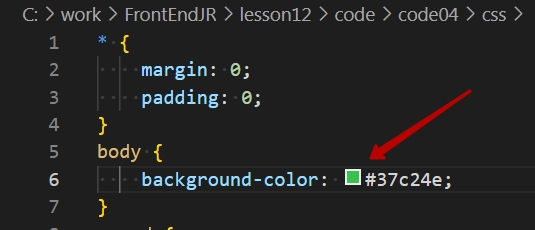  
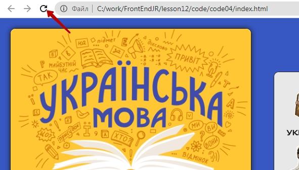  
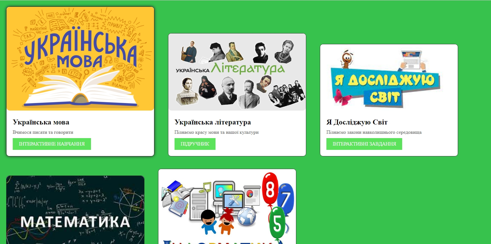  

###  Змінимо розмір картки

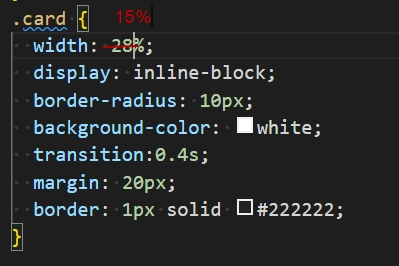  
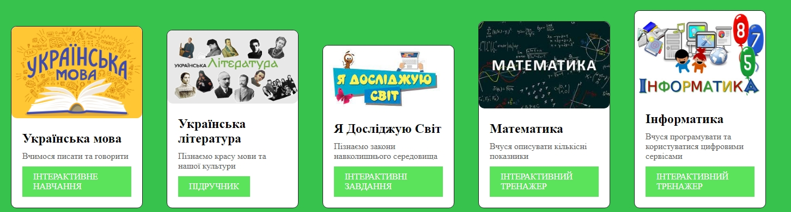  

* Підберіть такий розмір картки, щоб при наведенні на неї (і розширення активної картки) всі картки залишанися на одному рядку.

###  Скруглення картки
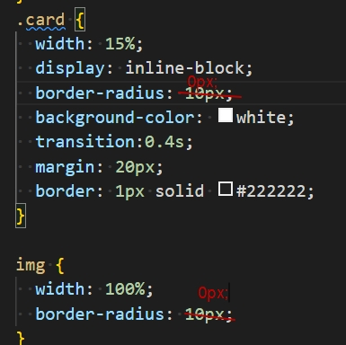  
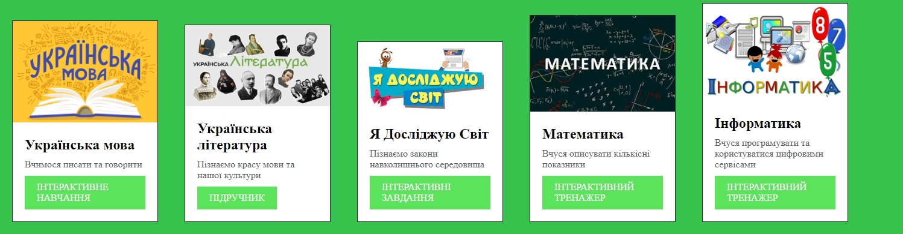  

###  Швидкість змін
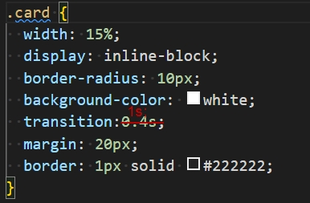  
Швидкість, яка була:  
  

Швидкість яка стала (знизилася):

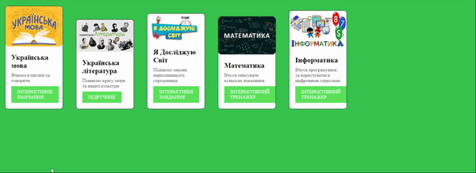  