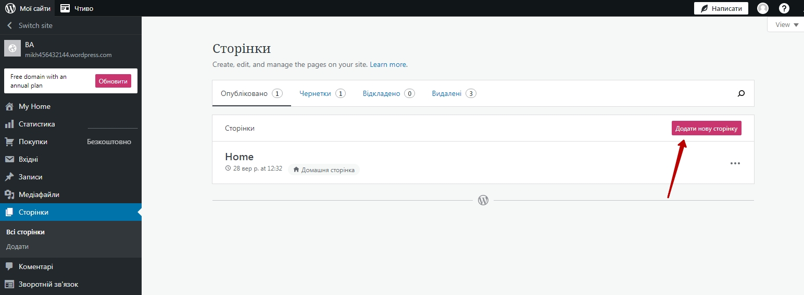

# Багатосторінковий сайт на wordpress.com
## Створимо сайт власної студії зі створення сайтів
  
  
  
  

### Матеріали для сайту
[Текст для майбутнього сайту (тема Stratford)](https://docs.google.com/document/d/1OO1N2GP5FeQLZ9X0RCgkCwP74XCNQLS7udkV79XR630/edit?usp=sharing)  

  
  
  
  
  
  
  
  
  
  
  
  

  
  
  

### Додаткове завдання
1. Адаптуйте описи на сайті під такі сайти, які ви можете створювати.
2. Змініть оформлення (підберіть зображення для блоків, в яких фон є картинкою).

## Додамо меню до створеного сайту
  
  
  
  
  
  
  
  
  
  
  
  
  
  
  
  
  
  
  

### Додаткове завдання
1. Розмістіть в розділі "Про нас" інформацію про себе як спеціаліста зі створення сайтів.
2. Під кожний вже створений сайт (розклад, каталог ігор, перелік шкільних предметів, особисту сторінку, тощо) створвть окрему сторінку (як сторінка "Проект"), на якій розмістить скріншот проекту, його опис та посилання на джерело.
3. Всі стоврінки із описами створених сайтів підключить як підменю під сторінку "Про нас".
